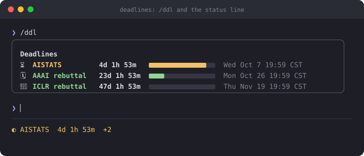
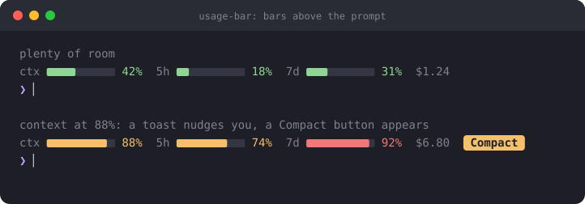
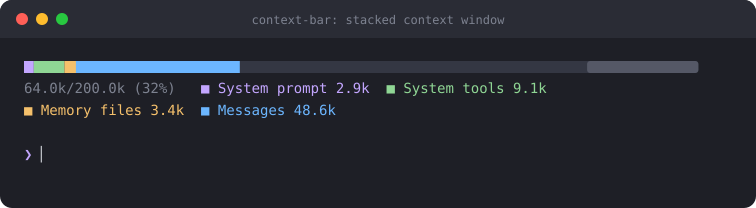

# claude-mods

Small [Claude Code mods](https://claude.com/blog/claude-code-mods) I use every day. Each one is a few dozen lines of TypeScript and installs like any plugin.

```
/plugin marketplace add richardcsuwandi/claude-mods
/plugin install <mod>@claude-mods
/reload-plugins
```

| Mod | What it does |
| --- | --- |
| [`deadlines`](#deadlines) | Live deadline countdowns in the status line, `/ddl` to manage them |
| [`usage-bar`](#usage-bar) | Context, 5h, 7d and cost bars above the prompt, plus an auto-compact nudge |
| [`context-bar`](#context-bar) | A stacked context-window bar, colored like `/context` |
| [`monitor`](#monitor) | A control room above the prompt: background agents and shells, blocked tool calls, context |

Mods run with the same access to your machine as Claude Code itself and aren't sandboxed. Read the source (each is one file in `plugins/<mod>/hooks/`) before you install.

> The images below are previews drawn from each mod's real output format and color thresholds, not captures of a live session (the `monitor` one is animated). Your terminal's font and theme will differ.

---

## deadlines



Keeps your upcoming deadlines in the status line and shows all of them on demand. The status line holds the next one with a live countdown (days, hours, minutes, refreshed every 15 seconds), and `+N` counts the rest.

```
/ddl                                          list everything as a card
/ddl add AISTATS 2026-10-06 aoe               add a deadline (time defaults to 23:59)
/ddl add Group meeting 2026-10-16 14:00       no zone = your local time
/ddl add ICML 2027-01-28 23:59 pst            any zone from the table below
/ddl add Thesis 2026-12-01 17:00 wib          Indonesia (WIB, WITA, WIT all work)
/ddl add Review 2026-11-03 09:00 +05:30       or a plain UTC offset (also utc-5, gmt+7)
/ddl rm AISTATS                               remove one
```

Whatever zone you type, the deadline is stored as an exact moment and shown in your own local time, so the countdown is always right. The confirmation echoes both, for example `Added ICML: Fri Jan 29 12:00 CST (2027-01-28 23:59 PST, UTC-08:00)`.

**Time zones**

| Region | Zones |
| --- | --- |
| Anywhere | `aoe` (UTC-12, "Anywhere on Earth"), `utc`, `gmt`, `local` (your machine) |
| US and Canada | `pst` `pdt` `mst` `mdt` `cst` `cdt` `est` `edt` `akst` `akdt` `hst` `ast` `nst`, plus `pt` `mt` `ct` `et`, which pick standard or daylight time from the deadline's date |
| Europe | `wet` `west` `bst` `cet` `cest` `eet` `eest` `msk` |
| Asia | `ist` (India) `pkt` `npt` `ict` `wib` `wita` `wit` `sgt` `hkt` `pht` `jst` `kst` |
| Oceania | `awst` `acst` `aest` `aedt` `nzst` `nzdt` |
| Any other | an offset such as `+08:00`, `-0530`, `+7`, `utc+7`, `gmt-5` |

Some abbreviations are ambiguous. `cst` means your own zone if that's what your machine reports (so it is China Standard Time in Shanghai) and US Central otherwise. `ist` is India. For anything else, use an offset. An unknown zone is refused with a message and nothing is saved.

`pt`, `et`, `ct` and `mt` follow the US rule (second Sunday of March to first Sunday of November). `cet` is always UTC+1, so use `cest` for European summer deadlines.

**How to read it**

| Time left | Emoji | Status glyph | Color |
| --- | --- | --- | --- |
| over 30 days | 🌱 | ○ | green |
| 7 to 30 days | 🗓 | ○ | green |
| 3 to 7 days | ⏳ | ◐ | amber |
| 1 to 3 days | 😬 | ◐ | amber |
| under 1 day | 🔥 | ● | red |

The bar in each row fills up over the last 30 days. Deadlines that have passed stay in the list, greyed out with a ✅, until you `rm` them. Names can contain spaces.

**Where your deadlines are saved**

In Claude Code's per-plugin store (`~/.claude/plugins/store/deadlines_<marketplace>-<hash>.json`). The file name depends on the plugin and marketplace names only, so updating the plugin keeps your list. A second copy is mirrored to `~/.claude/deadlines-backup.json`: if the store ever comes back empty or unreadable, `/ddl` restores from that copy instead of overwriting it, and keeps the unreadable value under `deadlines.corrupt`. Renaming the marketplace creates a fresh store, which is what the backup covers. Persistence tests and time zone parsing live in `plugins/deadlines/tests/` (run them with `claude plugin test plugins/deadlines`).

**Notes**

- Times shown are in your machine's timezone, read once when the session starts. A daylight-saving change mid-session is off by an hour until you restart.
- If the timezone can't be read (for example on Windows), times show in UTC.

---

## usage-bar



Three bars above the prompt: how full the context window is (`ctx`), and your 5-hour and 7-day usage limits, followed by the session cost in dollars. Bars turn amber at 70% and red at 90%. The set of limit bars depends on what your plan reports.

**Auto-compact nudge.** When the context passes 85% a toast tells you once to run `/compact`, and a **Compact** button appears next to the bars. It re-arms after the context drops back under 75%, so a compact doesn't silence the next warning. The nudge keeps working even while the bars are hidden.

```
/usage-bar        toggle the bars (on by default)
```

Updates after every turn.

---

## context-bar



One stacked bar showing what's filling the context window: system prompt, tools, memory files, messages, with the free space and the auto-compact buffer shown as dim blocks at the end. The colors match the ones `/context` uses, and a legend underneath lists each category with its size in tokens.

```
/context-bar      toggle the bar (off by default)
```

Updates after every turn using Claude Code's local token estimates, so it makes no extra API calls and costs no tokens. The bar resizes to your terminal width.

The categories in the preview are illustrative: yours come from your own session.

---

## monitor



A small control room above your prompt for everything Claude is doing in the background. When Claude starts a background agent or a shell with `run_in_background`, a rounded card appears with one row per job:

| Row | Meaning |
| --- | --- |
| 🤖 / ⚙️ blue name, sweeping bar, elapsed time | a background **agent** or **shell** that is still running. The bar shows activity, not progress |
| ✅ dim green `done` | the job finished. Stays until your next prompt, so you don't miss it |
| ❌ red `failed  needs you` | the job failed (non-zero exit, or the agent failed). Stays until your next prompt |
| ⏹ amber `stopped` | the job was killed, by you or by Claude |
| 🚫 amber `Bash blocked: ...` | a hook or permission refused a tool call, with the reason. Cleared at your next prompt |
| 🧠 `context` | how full the context window is: amber at 70%, red at 90%, and `compact` from 85% as a reminder to run `/compact` |

The header counts them (`Monitor  1 running  1 done  1 failed`). With nothing running and the context low, the card doesn't draw at all, so it never takes space when idle. It stacks with the bars above if you use `usage-bar` or `context-bar` too.

```
/monitor        pin the card so the context row is always visible; run again to unpin
                (unpinning also clears finished jobs)
```

**Try it.** Ask Claude: *"Run `sleep 30` and `sleep 45` as background jobs, and start one tiny haiku subagent that sleeps 20 seconds."* Add `exit 1` to one of them to see a failure.

**How it works.** It watches `Agent` and `Bash` calls from the main session. A shell counts as a job when its result carries a background task id, and an agent when it comes back `async_launched`. A job ends when Claude Code delivers the task notification for its id, and the notification's status (`completed`, `failed`, `killed`) picks the row. Tests: `claude plugin test plugins/monitor`.

**Notes**

- Finished rows show no duration. The notification arrives when Claude is free to read it, not when the job ended, so any time would be misleading.
- An agent that stops while its own background work is still running notifies once at that point, and again when it is really done. The row turns ✅ at the first notification, so it can read done slightly early.
- Subagents' own tool calls aren't tracked, only the jobs the main session starts.
- Inspired by [leitstand](https://github.com/dominikmartn/leitstand) (a control room for Claude Code). This is an independent implementation with a different look and no disk row.

---

## Adding a mod

Put it in `plugins/<name>/` (manifest in `.claude-plugin/plugin.json`, hooks in `hooks/`), add an entry to `.claude-plugin/marketplace.json`, run `claude plugin validate`, and push.
